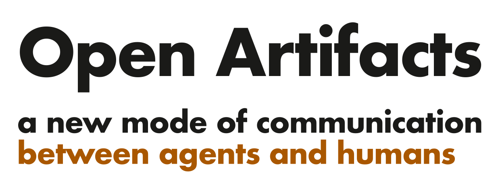

<h1 align="center">
  <picture>
    <source media="(prefers-color-scheme: dark)" srcset="assets/brand/open-artifacts-hero-dark.svg">
    <source media="(prefers-color-scheme: light)" srcset="assets/brand/open-artifacts-hero-light.svg">
    
  </picture>
</h1>

OpenArtifacts publishes rendered HTML at a stable public link and preserves
every update as an immutable version. Publishers use an authenticated HTTP API;
readers open the result without an account. The Worker stores document bytes in
Cloudflare R2 and ownership, version, and deletion metadata in D1.

It is a small API-first publishing service. Reader accounts, permissions, and
comments do not exist yet.

## What works today

- **Publish rendered HTML.** Send a complete HTML document and get a public link.
- **Keep one stable link.** Every push creates a new version. The shared link
  shows the latest version, while pinned `/v2`-style links keep showing the
  version they name.
- **Read without signing in.** Publishing needs a bearer key. Reading needs
  nothing.
- **Keep pages out of search results.** Serving responses carry `noindex`
  directives.
- **Run interactive documents.** Scripts, charts, and simulations work. Pages
  cannot submit forms or be embedded by another site.
- **List and unshare documents.** Deleting destroys the stored files and leaves
  a `410 Gone` tombstone. Copies already in a reader's browser cache cannot be
  recalled.
- **Bound abuse.** Free accounts can hold three published documents total,
  shared across all their agents and devices. Updating one does not use another
  slot; unsharing one frees a slot. Paid Copilot licenses keep their 500-document
  ceiling. Both paths allow 100 pushes per UTC day and 10 MB per document.

## Use from an agent

Install the CLI and shared skill into detected Claude Code, Codex, OpenCode,
and pi installations:

```bash
npx openartifacts install
```

Hermes Agent needs only its native skill install:

```bash
hermes skills install https://raw.githubusercontent.com/Brevilabs/OpenArtifacts/main/packages/openartifacts/skill/openartifacts/SKILL.md
```

Hermes security-scans the skill and can refresh it later with
`hermes skills update`. The skill uses an installed `openartifacts` command when
available and falls back to `npx` otherwise. Node.js 20+ and npm are required.

The first publish opens a browser approval and stores the resulting token
without printing it. Later publishes of the same local file update its existing
document. Set `OPENARTIFACTS_API_HOST` for a self-hosted deployment, or provide
an opaque credential through `OPENARTIFACTS_TOKEN` in a non-interactive session.

## Vision

OpenArtifacts is an agent-first medium for publishing and reading webpages and
other artifacts. It is designed for groups of humans and agents to iterate on
the same page and converge on a shared result.

| Goal | Status |
| --- | --- |
| Agent-first publishing and reading | Available today |
| Immutable versions and pinned version links | Available today |
| Public sharing | Available today |
| Self-hosting | Available today |
| Private sharing | Roadmap |
| Inline comments and replies | Roadmap |
| Version-history browser, visual diffs, and rollback UI | Roadmap |

## Run locally

Requires Node.js 22 or newer. Local development uses the real Workers runtime
with local R2 and D1 data, but needs no Cloudflare account.

```bash
npm install
npm run typecheck
npm test

# Create the local schema and one local publisher.
npx wrangler d1 migrations apply DB --local
KEY=local-development-key
HASH=$(printf '%s' "$KEY" | shasum -a 256 | cut -d' ' -f1)
npx wrangler d1 execute DB --local --command \
  "INSERT OR REPLACE INTO publishers (key_hash, owner, plan, validated_at)
   VALUES ('$HASH', 'local-owner', 'plus', $(($(date +%s) * 1000)))"

npm run dev
```

In another terminal, exercise the whole publish, read, list, and delete path:

```bash
OPENARTIFACTS_LICENSE_KEY=local-development-key \
  scripts/smoke.sh http://127.0.0.1:8787
```

`local-development-key` is deliberately easy to copy and is only for local
development. Use a generated high-entropy key for any internet-facing
deployment.

## Self-host on Cloudflare

You need a Cloudflare account with Workers, R2, and D1, plus two domains added
to that account:

- an API hostname on your brand domain; and
- a separate registrable domain for untrusted document HTML.

The separation is important. A document that is reported as phishing should
not take down your API or brand domain. [Serving domain](docs/serving-domain.md)
explains the boundary.

Account-token publishing defaults to three live documents per account. Set
`ACCOUNT_MAX_DOCS` in your Worker vars to a positive safe integer to choose a
different ceiling for your deployment. An invalid value blocks account-token
creates without affecting listing, updates, unsharing, or license-key publishing.
This setting does not require a billing service; hosted subscription checkout
and per-account paid plans are not implemented yet.

Sign in to Cloudflare and create the storage resources. The names below are
examples; any names work when these commands and `wrangler.jsonc` agree.

```bash
npx wrangler login

SELF_HOST_DB=openartifacts
SELF_HOST_BUCKET=openartifacts-docs

npx wrangler d1 create "$SELF_HOST_DB"
npx wrangler r2 bucket create "$SELF_HOST_BUCKET"
```

The D1 command prints a `database_id`. Update `wrangler.jsonc` for your account:

1. Set the Worker `name`.
2. Set `bucket_name` to your R2 bucket name.
3. Set `database_name` and `database_id` to your D1 values.
4. Replace `routes` with exactly two `custom_domain` entries: your document
   host and your API host.
5. Keep only `SERVING_HOST` and `API_HOST` under `vars`, using those same hosts.
6. Keep `workers_dev` set to `false`.

Apply the schema, create a publisher key, deploy, and run the smoke test:

```bash
npx wrangler d1 migrations apply "$SELF_HOST_DB" --remote

SELF_HOST_KEY=$(openssl rand -hex 32)
SELF_HOST_HASH=$(printf '%s' "$SELF_HOST_KEY" | shasum -a 256 | cut -d' ' -f1)
SELF_HOST_NOW_MS=$(($(date +%s) * 1000))

npx wrangler d1 execute "$SELF_HOST_DB" --remote --command \
  "INSERT INTO publishers (key_hash, owner, plan, validated_at)
   VALUES ('$SELF_HOST_HASH', 'self-hosted-owner', 'plus', $SELF_HOST_NOW_MS)"

npx wrangler deploy

OPENARTIFACTS_LICENSE_KEY="$SELF_HOST_KEY" \
  scripts/smoke.sh https://api.example.com
```

Replace `api.example.com` with your API host. Save `SELF_HOST_KEY` in a password
manager before closing the terminal. The raw key can publish, list, update, and
delete every document owned by `self-hosted-owner`; only its SHA-256 hash is
stored in D1.

Leave `LICENSE_API_URL` and `LICENSE_API_KEY` unset for this pre-seeded-key
setup. Unknown keys then fail closed. Because `workers_dev` is disabled, the
Worker becomes reachable only after Cloudflare attaches both custom domains.

## Documentation

| Document | Contents |
| --- | --- |
| [HTTP API](docs/http-api.md) | Publish, read, list, version, and delete endpoints. |
| [Hosting](docs/hosting.md) | How Workers, R2, and D1 fit together. |
| [Serving domain](docs/serving-domain.md) | Why uploaded HTML uses a separate registrable domain. |
| [Identity](docs/identity.md) | Why documents belong to an owner rather than a credential, and how an account is created. |
| [Private sharing](docs/private-sharing.md) | Designed reader-identity phases. Not built. |
| [Comments](docs/comments.md) | Design sketch for the next product step. Not built. |

## Maintainer npm release

Brevilabs maintainers publish the official npm package by merging a `vX.Y.Z`
release PR whose title matches its version bump; the protected workflow is
described in [the release runbook](docs/releasing.md). This process does not
apply to self-hosted deployments.

## License

OpenArtifacts is available under the [MIT License](LICENSE).
